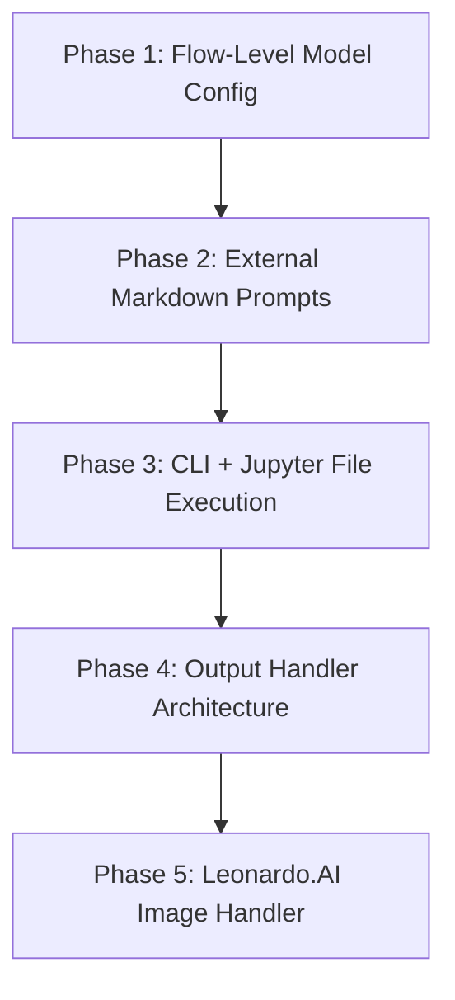

# PromptFlow — Feature Implementation Plan

This implementation plan outlines the step-by-step technical architecture, database changes, code modifications, testing procedures, and verification criteria for implementing the 5-phase PromptFlow feature enhancement suite.

---

## Architectural Principles & Guiding Constraints

1. **DB-Driven Web Application**: PostgreSQL/SQLAlchemy DB remains the single source of truth for web flow and form execution.
2. **Preserve Flow Engine Core**: The existing `flow_executor` and `form_executor` orchestration pipeline will be extended modularly, avoiding duplicate runtime engines.
3. **File-Based Execution Mode**: CLI and Jupyter executions bypass the web DB for execution state persistence, relying on local filesystem JSON inputs and outputs.
4. **Model Fallback Hierarchy**: Explicit Step/Form Model $\rightarrow$ Flow-Level Model $\rightarrow$ System Default (`openai/gpt-4o-mini`, `temp: 0.7`).
5. **Decoupled Extensions**: Output handling (JSON, Markdown, Image generation) and provider adapters (Leonardo.AI) reside in dedicated strategy handlers outside the flow execution loop.
6. **Strict Security & Compatibility**: Zero API key leakage in outputs, logs, or UI; 100% backward compatibility for existing flows, forms, and `flow_form_steps`.

---

## Phase Breakdown Overview



---

## Phase 1 — Flow-Level Model Configuration

### 1.1 Goal
Enable flows to define a default model configuration (`provider`, `name`, `temperature`) that cascades down to steps unless overridden at the step/form level.

### 1.2 Model & Database Schema Changes
* **Database Model (`backend/models/flow.py`)**:
  * Add `model_configuration` column (`db.JSON` or `db.Text` storing JSON string) to the `flows` table.
* **Pydantic Runtime Schema (`backend/runtime/schemas/prompt_flow.py` & `backend/services/schemas/prompt_flow.py`)**:
  * Add optional `model: ModelSettings | None = None` to `PromptFlow` schema.
* **Alembic Migration**:
  * Generate and apply migration script `add_model_configuration_to_flows`.

### 1.3 Execution Logic Updates
* **Model Resolution Algorithm (`backend/services/flow_executor.py` & `backend/runtime/flow_executor.py`)**:
  ```python
  def resolve_step_model(flow: PromptFlow, step_form: PromptForm) -> ModelSettings:
      # Priority 1: Step/Form level model (if non-default or explicitly set)
      if step_form.model and step_form.model.is_explicit:
          return step_form.model
      # Priority 2: Flow level model
      if flow.model:
          return flow.model
      # Priority 3: Form level model default / System default
      return step_form.model or SystemDefaultModel
  ```

### 1.4 API & UI Updates
* **Backend API (`backend/routes.py` / `routes/flows.py`)**:
  * Update `POST /api/flows` and `PUT /api/flows/<id>` to accept and return `model` configuration.
  * Update seed data in `backend/seed.py` with sample flow-level model configurations.
* **Frontend UI (`frontend/src/routes/flows.tsx` & Flow Form components)**:
  * Add UI controls in Flow Editor for selecting Provider, Model Name, and Temperature slider.

### 1.5 Verification & Tests
* Unit test resolution hierarchy in `backend/tests/test_flow_model_resolution.py`:
  * Test Form override > Flow model.
  * Test Flow model fallback when Form model is default/omitted.
  * Test System default fallback when neither Flow nor Form specifies a custom model.
* Run full test suite (`pytest`).

---

## Phase 2 — External Markdown Prompts $\rightarrow$ Forms

### 1.1 Goal
Parse `.md` files containing multiple prompt definitions separated by HTML comments into PromptFlow-compatible `Form` and `Prompt` structures.

### 2.2 Markdown Parsing Architecture
Create reusable module `backend/services/markdown_prompt_parser.py`:

```
<!-- PROMPT: prompt_id -->
System / User Prompt text with {{variable}} placeholders.
```

* **Delimiter Spec**: `<!-- PROMPT:\s*([a-zA-Z0-9_\-]+)\s*-->`
* **Placeholder Spec**: `\{\{([a-zA-Z0-9_\.]+)\}\}`
* **Parser Responsibilities**:
  1. Read Markdown content.
  2. Split sections by `PROMPT:` comment markers.
  3. Extract Prompt ID and prompt text.
  4. Parse unique placeholders (e.g. `{{company}}`, `{{industry}}`).
  5. Generate corresponding `FieldSchema` list (type `"text"` or `"textarea"`, label derived from ID).
  6. Construct valid `PromptForm` dictionary/Pydantic object.

### 2.3 Error Handling & Validation
* Raise `MarkdownPromptParseError` for:
  * File containing no valid `<!-- PROMPT: ... -->` comments.
  * Duplicate prompt IDs in a single `.md` file.
  * Invalid placeholder syntax or unclosed tags.

### 2.4 Service & DB Integration
* Create `import_markdown_prompts_to_forms(filepath_or_str)` helper in `backend/services/form_service.py` to allow converting `.md` prompts into database `Form` records seamlessly.

### 2.5 Verification & Tests
* Create `backend/tests/test_markdown_parser.py`:
  * Single prompt parsing.
  * Multi-prompt parsing.
  * Duplicate ID rejection test.
  * Form field schema generation accuracy test.
* Run full test suite (`pytest`).

---

## Phase 3 — CLI + Jupyter File-Based Execution

### 3.1 Goal
Provide CLI and Python API interfaces allowing developers to execute existing Flows using local JSON input files without interacting with the web application database or creating `SavedResult` records.

### 3.2 File Execution Architecture

```
CLI / Jupyter API ──> Load JSON Input File ──> Validate Fields ──> Core Flow Engine ──> Output JSON File
```

* **Execution Directory Standard**:
  * Inputs: `./inputs/<filename>.json`
  * Outputs: `./outputs/<filename>.json`

### 3.3 Component Design
* **CLI Entrypoint (`backend/cli.py`)**:
  * Argument parser: `promptflow run <flow_slug_or_path> --input <input_json> [--output <output_json>]`
  * Standalone execution runner bypassing Flask application request context / DB dependencies where applicable.
* **Python / Jupyter API (`promptflow` package export)**:
  ```python
  import promptflow

  result = promptflow.run(
      flow="blog_generator",
      input="./inputs/company.json",
      output="./outputs/company.json"
  )
  ```

### 3.4 Input & Schema Validation
* Load JSON from `--input` path.
* Validate against required input fields of the target Flow's step forms.
* Raise informative CLI/Python errors for missing file, malformed JSON, or missing required field values.

### 3.5 Verification & Tests
* Create `backend/tests/test_cli_execution.py`:
  * Test execution via Python runner with mock LLM response.
  * Test missing file error handling.
  * Test invalid JSON format handling.
  * Verify output file creation and content integrity.
* Run full test suite (`pytest`).

---

## Phase 4 — Output Handler Architecture

### 4.1 Goal
Establish a flexible, extensible output handling framework to transform and persist structured flow execution outputs into various artifact formats (JSON, Markdown, Images, Documents) without modifying the Flow engine logic.

### 4.2 Handler Design Pattern

```
Flow Execution Output
       │
       ▼
 ┌──────────┐
 │ Registry │
 └────┬─────┘
      ├───────────────────────┬────────────────────────┐
      ▼                       ▼                        ▼
┌────────────┐      ┌──────────────────┐     ┌────────────────────┐
│ JSONHandler│      │ MarkdownHandler  │     │ Custom/Image       │
└────────────┘      └──────────────────┘     └────────────────────┘
```

* **Interface Definition (`backend/services/output_handlers/base.py`)**:
  ```python
  class BaseOutputHandler(ABC):
      @abstractmethod
      def process(self, raw_output: dict | str, options: dict) -> OutputResult:
          pass
  ```
* **Implementations**:
  * `JSONOutputHandler`: Formats and formats structured JSON files.
  * `MarkdownOutputHandler`: Renders raw strings or transforms JSON data using template rules into Markdown documents.
  * `OutputHandlerRegistry`: Factory for registering and resolving handlers by name/type.

### 4.3 JSON $\rightarrow$ Markdown Transformation Engine
* Support template-driven JSON-to-Markdown rendering rules (`backend/services/output_handlers/markdown_transformer.py`).
* Allows flows to output structured JSON data while output handlers render it into styled Markdown reports without embedding layout logic into prompts.

### 4.4 Verification & Tests
* Create `backend/tests/test_output_handlers.py`:
  * Handler registration test.
  * JSON handler output test.
  * Markdown transformer template substitution test.
* Run full test suite (`pytest`).

---

## Phase 5 — Leonardo.AI Image Generation Handler

### 5.1 Goal
Extend image prompt generation flows to generate actual images using Leonardo.AI via the Phase 4 Output Handler pattern.

### 5.2 Standard Image Generation JSON Specification
Internal provider-agnostic representation emitted by LLM flow steps:
```json
{
  "type": "image",
  "prompt": "A futuristic metropolis at dusk, cyberpunk style, cinematic lighting",
  "negative_prompt": "blurry, oversaturated, low resolution",
  "width": 1024,
  "height": 1024,
  "num_images": 1
}
```

### 5.3 Leonardo Adapter & Output Handler
* **Adapter (`backend/services/adapters/leonardo_adapter.py`)**:
  * Reads `LEONARDO_API_KEY` from environment variables.
  * Maps standard image JSON payload to Leonardo API endpoint specs (e.g. `POST /api/rest/v1/generations`).
  * Polls generation status or handles async payload retrieval.
  * Downloads generated image files and stores them in designated outputs directory.
* **Handler (`backend/services/output_handlers/leonardo_handler.py`)**:
  * Implements `BaseOutputHandler`.
  * Intercepts `type: "image"` flow outputs and routes them to `LeonardoAdapter`.
  * Returns image metadata (file paths, URLs, generation ID) back to the execution response context.

### 5.4 Security & Error Handling
* Ensure API keys are strictly sanitized from logs, UI debug output, and persistent output files.
* Provide clear error messaging if `LEONARDO_API_KEY` is missing or API quota/rate-limits are exceeded.

### 5.5 Verification & Tests
* Create `backend/tests/test_leonardo_handler.py`:
  * Unit test standard image JSON schema validation.
  * Unit test `LeonardoAdapter` with mocked HTTP responses (`unittest.mock` / `responses`).
  * Integration test of flow execution routing to image output handler.
* Run full test suite (`pytest`).

---

## Summary of Files to Modify & Add

| Phase | Path / File | Action | Description |
| :--- | :--- | :--- | :--- |
| **Phase 1** | `backend/models/flow.py` | Modify | Add `model_configuration` field to `Flow` ORM model. |
| **Phase 1** | `backend/runtime/schemas/prompt_flow.py` | Modify | Add `model` field to `PromptFlow` schema. |
| **Phase 1** | `backend/services/flow_executor.py` | Modify | Implement 3-tier model resolution logic. |
| **Phase 1** | `backend/routes.py` | Modify | Update flow creation/editing routes to persist model config. |
| **Phase 1** | `frontend/src/routes/flows.tsx` | Modify | Add Flow model settings UI controls. |
| **Phase 1** | `backend/tests/test_flow_model_resolution.py` | Add | Add unit/integration tests for model resolution. |
| **Phase 2** | `backend/services/markdown_prompt_parser.py` | Add | Implement Markdown prompt parser module. |
| **Phase 2** | `backend/services/form_service.py` | Modify | Add helper to create forms from parsed Markdown. |
| **Phase 2** | `backend/tests/test_markdown_parser.py` | Add | Add parser unit tests. |
| **Phase 3** | `backend/cli.py` | Add | Add CLI entrypoint for file-based flow execution. |
| **Phase 3** | `backend/python_api.py` / `__init__.py` | Add | Add `promptflow.run(...)` Python API for Jupyter. |
| **Phase 3** | `backend/tests/test_cli_execution.py` | Add | Add CLI & Jupyter API tests. |
| **Phase 4** | `backend/services/output_handlers/base.py` | Add | Define `BaseOutputHandler` abstract class. |
| **Phase 4** | `backend/services/output_handlers/json_handler.py` | Add | Implement `JSONOutputHandler`. |
| **Phase 4** | `backend/services/output_handlers/markdown_handler.py` | Add | Implement `MarkdownOutputHandler` & transformer. |
| **Phase 4** | `backend/services/output_handlers/registry.py` | Add | Implement handler registry. |
| **Phase 4** | `backend/tests/test_output_handlers.py` | Add | Add output handler unit tests. |
| **Phase 5** | `backend/services/adapters/leonardo_adapter.py` | Add | Implement Leonardo.AI API adapter. |
| **Phase 5** | `backend/services/output_handlers/leonardo_handler.py` | Add | Implement `LeonardoOutputHandler`. |
| **Phase 5** | `backend/tests/test_leonardo_handler.py` | Add | Add mocked adapter & image handler tests. |

---

## Phase Rollout & Verification Workflow

For each phase:
1. **Implement Phase Components**: Create/update code adhering to strict architecture rules.
2. **Execute Pytest**: Run `pytest` to confirm existing 44 tests pass and new feature tests pass cleanly.
3. **Verify API / CLI / UI**: Conduct runtime validation.
4. **Update Documentation**: Log changes, schema updates, API updates, and configuration flags.
